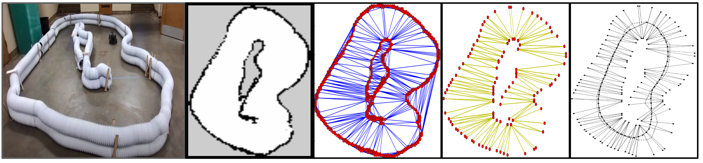

# f1ten-competition codebase

### Collection of ROS packages developed for autonomous racing competition F1/10th Grand Prix.

## ROS Packages

This codebase contains following ROS packages developed for autonomous racing competition in 2023.

1. **System:**

    **a. Serial:**  A serial library to handle communication with hardware.
    Link for detailed documentation: https://github.com/wjwwood/serial

    **b. URG Node:** ROS wrapper for the Hokuyo urg_c library.
    Link to repository: https://github.com/ros-drivers/urg_node

    **c. Racecar:** Brings up the car by launching all the necessary nodes.
    Contains multiplexer for input commands which is used to decide priorities of the inputs coming from different sources.
    Forked from: https://github.com/mit-racecar/racecar

2. **Localization and Mapping:**

    **a. Particle filter:** Python implementation of particle filter modified and tuned for the F110 platform.
    The implementation uses RangeLibc for accelerated ray casting.
    Orinal implementation of range_libc can be found at: 
    https://github.com/kctess5/range_libc

    **b. LaserScanMatcher and SLAM Gmapping:** Used off-the-shelf not included in the repository.

3. **PP variants:**

    This package contains implementation of variants of Pure Pursuit (PP) implementation, Automatic emergency breaking, behavior state machine and dynamic obstacle avoidance.

    **a. Automatic Emergency breaking:**

    Calculates TTC(Time to collision) using lidar data and applies brakes when a certain threshold is met.

    **b. Pure Pursuit:**

    Pure pursuit variants include fixed horizon and dynamic planning horizon methods. Dynamic horizon variants reduce turning and improve total lap time.

    **c. Obstacle avoidance:**

    During race-line optimization, two fallback trajectories are generated to fallback to if the optimal race-line is blocked by an obstacle. The IsCentreFree method continuously checks for centre trajectory         status using a safety radius parameter. We provide two nodes:

        i. Static obstacle avoidance

        ii. Dynamic obstacle avoidance
     

    **d. Behavior state machine:**

    This module is integrated in obstacle avoidance module. The car needs to decide whether to overtake the car in the front or to follow it and wait for good overtaking window. We decide the overtaking based on     track curvature. If the track is straight then the car will always attempt to overtake. On curved track, we decide based on estimated speed of the car in front.


4. **Trajectory_gen**

    This is a set of python scripts used for optimal raceline generation.
    The image below shows a preview of step 1 of the trajectory generation.

    

    We use delaunay triangulation to identify track borders and then classify them into left and right side points with respect to the base link frame. Left and right side points are then associated with each other and the track is discretized into a list of segments. These are further optimized using helpers library from https://github.com/TUMFTM/trajectory_planning_helpers.

5. **Assignment**

    This set of scripts contains implementations of simple yet powerful reactive algorithms such as wall following, gap following etc. It also includes a C++ implementation of RRT (Vanilla).


## Dependencies

Required:
* [catkin](http://www.ros.org/wiki/catkin) - cmake and Python based buildsystem
* [cmake](http://www.cmake.org) - buildsystem
* [Python](http://www.python.org) - scripting language
  * [empy](http://www.alcyone.com/pyos/empy/) - Python templating library
  * [catkin_pkg](http://pypi.python.org/pypi/catkin_pkg/) - Runtime Python library for catkin
* [gmapping](https://github.com/ros-perception/slam_gmapping/tree/melodic-devel) - SLAM Gmapping
* [ScanMatcher](https://wiki.ros.org/laser_scan_matcher) - Laser Scanmatcher
* [Laser_Geometry](https://github.com/ros-perception/laser_geometry) - Laser Geometry

## Usage


Remember to source the setup.bash file in the local workspace

```sh
echo "source /opt/ros/ROSDISTRO/setup.bash" >> ~/.bashrc
```

### Clone the repository in the src folder

```sh
$ tree

ws_ros
├── build
├── install
├── log
└── src
    └── F110_GRANDPRIX_2023
        ├── src
        └── README.md

```

### Build the workspace

```sh
cd ros_ws
catkin_make
source devel/setup.bash
```

### Launch nodes

For mapping offline with a rosbag:

```sh
roslaunch racing_core mapping_offline.launch
rosrun map_saver map_saver
```

For online mapping (SLAM)
```sh
roslaunch racing_core mapping_online.launch
rosrun map_saver map_saver
```

For racing with behavior tree (Overtaking & obstacle avoidance)

```sh
roslaunch racing_core full_state_runner.launch
```
